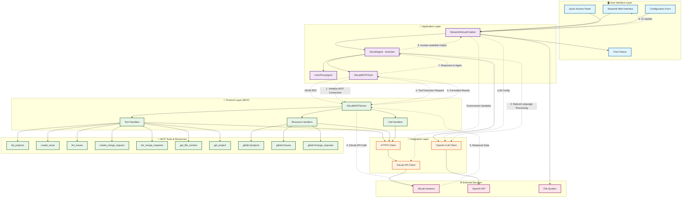

# GitLab MCP Server with AutoGen and Streamlit

A comprehensive solution for interacting with GitLab using Model Context Protocol (MCP), AutoGen agents, and a Streamlit web interface.

## 📋 Requirements

### Python Dependencies

Create a `requirements.txt` file:

```txt
# Core dependencies
streamlit>=1.28.0
autogen-agentchat>=0.2.0
mcp>=1.0.0
httpx>=0.25.0
pydantic>=2.0.0

# Additional utilities
python-dotenv>=1.0.0
asyncio-mqtt>=0.13.0
GitPython>=3.1.0

# Optional: For enhanced functionality
pandas>=2.0.0
plotly>=5.0.0
```

### System Requirements

- Python 3.8+
- GitLab instance (gitlab.com or self-hosted)
- OpenAI API access (or compatible LLM API)

## 🚀 Setup Instructions

### 1. Environment Setup

```bash
# Clone or create your project directory
mkdir gitlab-mcp-chatbot
cd gitlab-mcp-chatbot

# Create virtual environment
python -m venv venv
source venv/bin/activate  # On Windows: venv\Scripts\activate

# Install dependencies
pip install -r requirements.txt
```

### 2. Environment Variables

Create a `.env` file in your project root:

```env
# GitLab Configuration
GITLAB_URL=https://gitlab.com
GITLAB_TOKEN=your_gitlab_personal_access_token

# OpenAI Configuration
OPENAI_API_KEY=your_openai_api_key

# Optional: Custom MCP server settings
MCP_SERVER_HOST=localhost
MCP_SERVER_PORT=8000
```

### 3. GitLab Token Setup

1. Go to your GitLab instance
2. Navigate to User Settings > Access Tokens
3. Create a new token with these scopes:
   - `api` (full API access)
   - `read_user`
   - `read_repository`
   - `write_repository` (if you want to create issues/MRs)

### 4. File Structure

Organize your files like this:

```
gitlab-mcp-chatbot/
├── .env
├── requirements.txt
├── gitlab_mcp_server.py
├── autogen_gitlab_agent.py
├── streamlit_gitlab_chatbot.py
├── README.md
└── gitlab_workspace/  # Created automatically for code execution
```

## 🏃‍♂️ Running the Application

### Method 1: Streamlit Web Interface (Recommended)

```bash
# Start the Streamlit app
streamlit run streamlit_gitlab_chatbot.py
```

Then:
1. Open your browser to the displayed URL (usually http://localhost:8501)
2. Configure GitLab credentials in the sidebar
3. Click "Connect to GitLab"
4. Start chatting!

### Method 2: Direct MCP Server

```bash
# Run the MCP server directly
python gitlab_mcp_server.py
```

### Method 3: AutoGen Agent Testing

```bash
# Test the AutoGen integration
python autogen_gitlab_agent.py
```

## 🔧 Configuration Options

### LLM Models

The system supports various OpenAI models:
- `gpt-4` (recommended for best results)
- `gpt-4-turbo`
- `gpt-3.5-turbo` (faster, lower cost)

### Custom GitLab Instance

For self-hosted GitLab:
```env
GITLAB_URL=https://your-gitlab-instance.com
```

### MCP Server Customization

You can modify the MCP server to add custom tools:

```python
# Add to GitLabMCPServer._setup_handlers()
Tool(
    name="custom_tool",
    description="Your custom GitLab operation",
    inputSchema={
        "type": "object",
        "properties": {
            "param": {"type": "string"}
        }
    }
)
```

## 🎯 Usage Examples

### Basic Operations

1. **List Projects**: "Show me my GitLab projects"
2. **Project Details**: "Get details for project 'my-repo'"
3. **Create Issue**: "Create an issue titled 'Bug fix needed' in project 123"
4. **List Issues**: "Show me open issues in project 'my-repo'"
5. **Merge Requests**: "List merge requests for project 123"
6. **File Content**: "Show me the README.md from project 'my-repo'"

### Advanced Operations

1. **Multi-step Workflows**: "Create an issue for the bug in project A, then check if there are similar issues in project B"
2. **Cross-project Analysis**: "Compare the number of open issues between my top 3 projects"
3. **Code Review**: "Show me the latest merge request in project X and summarize the changes"

## 🐛 Troubleshooting

### Common Issues

1. **MCP Server Won't Start**
   - Check GitLab token permissions
   - Verify network connectivity to GitLab
   - Ensure all dependencies are installed

2. **AutoGen Connection Errors**
   - Verify OpenAI API key is valid
   - Check rate limits
   - Ensure sufficient API credits

3. **Streamlit Interface Issues**
   - Clear browser cache
   - Check console for JavaScript errors
   - Restart the Streamlit server

### Debug Mode

Enable verbose logging:

```python
import logging
logging.basicConfig(level=logging.DEBUG)
```

### Testing Connection

```python
# Test GitLab API access
import httpx
import os

async def test_gitlab():
    token = os.getenv("GITLAB_TOKEN")
    url = os.getenv("GITLAB_URL", "https://gitlab.com")
    
    async with httpx.AsyncClient(headers={"Private-Token": token}) as client:
        response = await client.get(f"{url}/api/v4/user")
        print(f"Status: {response.status_code}")
        print(f"User: {response.json()}")

# Run: asyncio.run(test_gitlab())
```

## 🔒 Security Considerations

1. **Token Security**
   - Never commit tokens to version control
   - Use environment variables or secure vaults
   - Rotate tokens regularly

2. **Network Security**
   - Use HTTPS for all GitLab communications
   - Consider VPN for self-hosted instances

3. **Data Privacy**
   - Be aware that chat data may be sent to OpenAI
   - Consider using local LLMs for sensitive data

## 🚀 Advanced Features

### Custom Agents

Extend the AutoGen agent with custom capabilities:

```python
class CustomGitLabAgent(GitLabAgent):
    def custom_workflow(self):
        # Your custom GitLab workflow
        pass
```

### Webhook Integration

Add webhook support for real-time updates:

```python
# Add to your MCP server
@app.post("/webhook")
async def handle_webhook(request):
    # Process GitLab webhooks
    pass
```

### Database Integration

Store chat history and analytics:

```python
# Add database connection
import sqlite3
# Store interactions for analysis
```

## 📚 API Reference

### MCP Server Tools

- `list_projects(search?, limit?)` - List GitLab projects
- `get_project(project_id)` - Get project details
- `create_issue(project_id, title, description?, labels?)` - Create issue
- `list_issues(project_id, state?, limit?)` - List issues
- `create_merge_request(project_id, title, source_branch, target_branch, description?)` - Create MR
- `list_merge_requests(project_id, state?, limit?)` - List MRs
- `get_file_content(project_id, file_path, ref?)` - Get file content

### Environment Variables

- `GITLAB_URL` - GitLab instance URL
- `GITLAB_TOKEN` - Personal access token
- `OPENAI_API_KEY` - OpenAI API key
- `MCP_SERVER_HOST` - MCP server host (optional)
- `MCP_SERVER_PORT` - MCP server port (optional)

## 🤝 Contributing

1. Fork the repository
2. Create a feature branch
3. Add tests for new functionality
4. Submit a pull request

## 📄 License

This project is licensed under the MIT License - see the LICENSE file for details.


## Architecture Diagram


